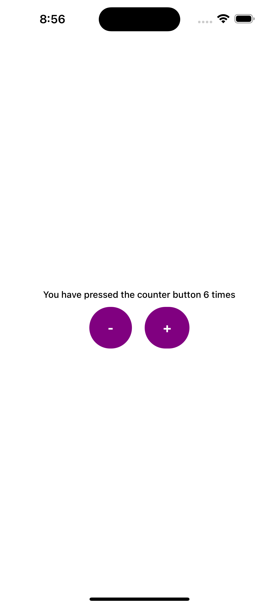

# Simple Counter App 🔢

This is a basic counter app built using **React Native**. The purpose of this app is to refresh fundamental React Native concepts such as `useState`, button handling, and basic styling.

---

## Features ✨
- Increment and decrement the counter using buttons.
- Displays the current count in the center of the screen.
- Simple UI with minimal styling to focus on functionality.

---

## Screenshot 📸


---

## How to Run 🏃‍♂️

1. Clone the repository:
    ```bash
    git clone https://github.com/anirudhsingh8/counter-app.git
    ```

2. Navigate to the project directory:
    ```bash
    cd counter-app
    ```

3. Install dependencies:
    ```bash
    npm install
    ```

4. Run the app on an Android or iOS simulator:
    ```bash
    npm start
    ```

---

## Concepts Used 💡
- **React Hooks**: Used `useState` to manage the counter's state.
- **Button Handling**: Added buttons to handle the counter increment and decrement logic.
- **Styling**: Basic styling for layout and positioning.
